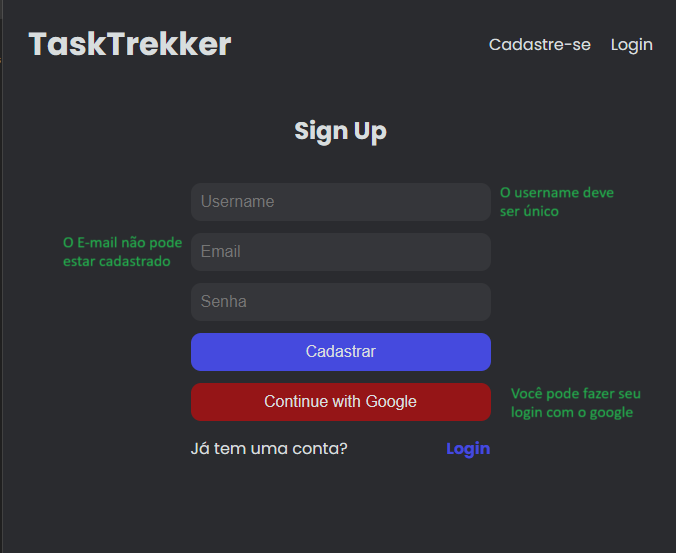
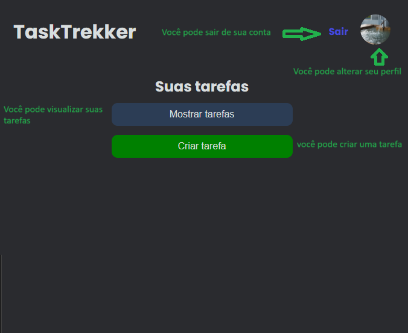
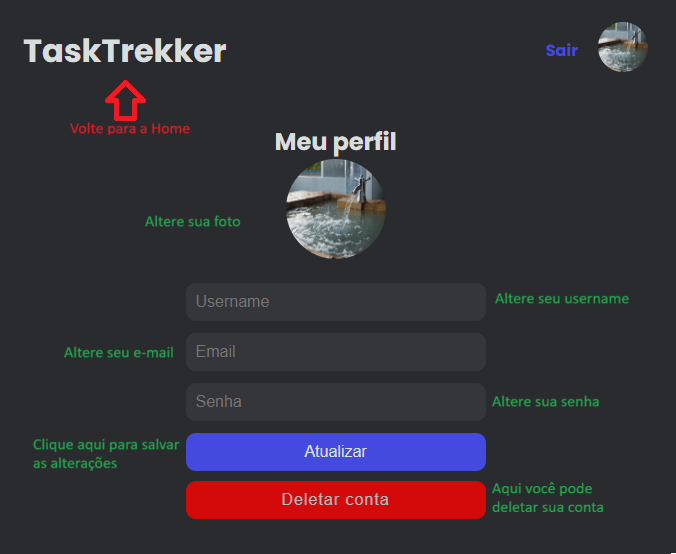
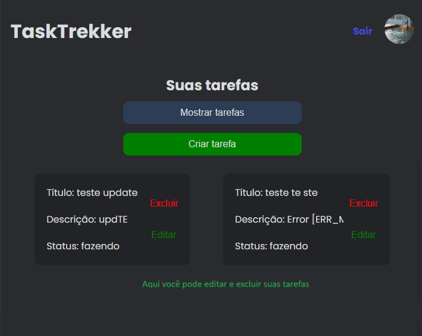
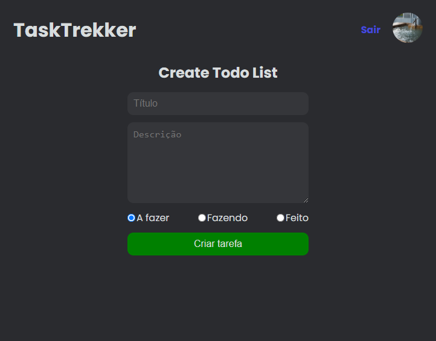
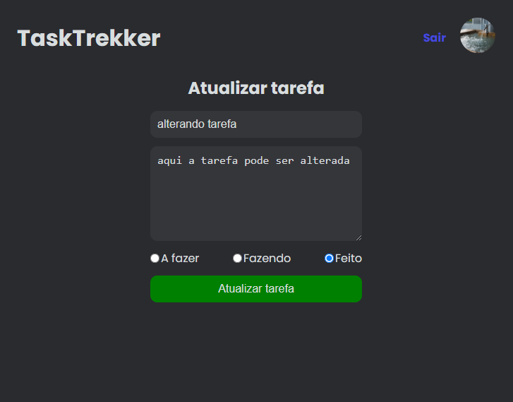

# Task-Trekker

O *Task-Trekker* é um To Do List para adicionar as tarefas do dia a dia.

Com ele você pode:


#### Fazer o login:
##### Crie seu login ou entre com sua conta google


#### Home:


#### Altere seu pefil:
##### Altere sua foto, username, email e senha ou delete sua conta


#### Criar, Editar e Excluir Tarefas:
##### Crie, edite e exclua suas tarefas.





# Tecnologias Utilizadas
Node.js // MongoDB // Postman //React + Vite

Bibliotecas:
CORS, Dotenv, Express, Mongoose, reduxjs, firebase, react, react-dom, react-icons, react-redux, react-router-dom, redux-persist, styled-components, render, cookie-parser, jsonwebtoken

# Variáveis de Ambiente

Para rodar esse projeto, você vai precisar adicionar as seguintes variáveis de ambiente no seu .env

### Na pasta api:
```bash
MONGODB_URL = local
JWT_SECRET = local
```
### Na pasta client:
```bash
VITE_FIREBASE_API_KEY = local
```
# Deploy

### Render
https://datadynamo.onrender.com/clientes


Para fazer o deploy desse projeto vc deve ter o NodeJS instalado, nesse projeto utilizamos a versão:

***Clone o projeto***
*No terminal*:
###### com HTTPS
```bash
git clone https://github.com/SuayMack/task-trekker.git
```

###### com SSH
```bash
git clone git@github.com:SuayMack/task-trekker.git
```

###### ***Entre no diretório api do projeto***

```bash
cd api
```

###### ***Abra com code (opcional) ou pelo terminal de sua preferência***

```bash
code .
```

###### ***Instale as dependências***

```bash
npm install
```
###### ***Entre no diretório client do projeto***

```bash
cd client
```

###### ***Abra com code (opcional)***

```bash
code .
```

###### ***Instale as dependências***

```bash
npm install
```


###### ***Inicie o servidor***

*Entre am cada um dos diretórios e digite o comando:*

```bash
npm run dev
```

###### as respostas devem ser:

###### *no diretório api:*

🎉😁 - Server is running on 5000! - 🙌
🎉😁 - Connected to MongoDB! - 🙌

###### *no diretório client

```bash
> client@0.0.0 dev
> vite
VITE v4.4.11  ready in 578 ms

  ➜  Local:   http://localhost:5173/     
  ➜  Network: use --host to expose       
  ➜  press h to show help
```

#### 🎉🎉🎉 É isso, aproveite o projeto.

# Teste Rotas

***Certifique-se de ter o Postman ou Insomnia instalado em seu sistema. São 3 entidades.***

 - [Postman - Download](https://www.postman.com/downloads/) 

 - [Insomnia - Download](https://insomnia.rest/download)

## 📲 AUTH

#### POST - Rota: '/api/auth/signup' 
 *A rota post cria o usuário*

###### Entrada
```bash
{
  "username": "user9",
  "email":"user9@user9",
  "password":"123"
}

```      
###### Saída
```bash
{
	"🎉 Usuário criado com sucesso! 😁"
}
```

#### POST - Rota: /api/auth/signin' 
 *Faz o login dos usuários*
     
###### Saída
```bash
{
    "_id": "652a09dda59bb1659702bca6",
    "username": "user9@user9",
    "email": "user9@user9",
    "avatar": "https://img.freepik.com/vetores-gratis/cao-husky-bonito-piloto-dos-desenhos-animados-vector-icon-ilustracao-conceito-de-icone-de-transporte-animal-isolado_138676-7486.jpg?w=740&t=st=1696887344~exp=1696887944~hmac=6169696cca801147fca71b43bb56fa3085c1a3f354693a6c6a14344a5288798a",
    "createdAt": "2023-10-14T03:24:13.847Z",
    "updatedAt": "2023-10-15T03:51:49.071Z",
    "__v": 0
}
```

###### ⛔ Tratamento de Erro do POST: 

##### sign-up *Usuário já cadastrado*:
```
{
    "success": false,
    "statusCode": 406,
    "message": "Usuário ou Email já cadastrado!"
}
```

##### sign-in *Usuário não está cadastrado*:
```
{
    "success": false,
    "statusCode": 404,
    "message": "Usuário ou Email não encontrado!"
}
```

## 😁 user

#### POST - Rota: '/api/user/update/id' 

 *A rota post atualiza os dados do usuário*

###### Entrada

```bash
{
  "email": "user99@user99.com.br
}
```      

###### Saída
```bash
{
    "_id": "652a09dda59bb1659702bca6",
    "username": "user9@user9",
    "email": "teste@testde.com.br",
    "avatar": "https://img.freepik.com/vetores-gratis/cao-husky-bonito-piloto-dos-desenhos-animados-vector-icon-ilustracao-conceito-de-icone-de-transporte-animal-isolado_138676-7486.jpg?w=740&t=st=1696887344~exp=1696887944~hmac=6169696cca801147fca71b43bb56fa3085c1a3f354693a6c6a14344a5288798a",
    "createdAt": "2023-10-14T03:24:13.847Z",
    "updatedAt": "2023-10-15T13:56:18.207Z",
    "__v": 0
}
```

#### DELET - Rota: '/api/user/delete/ID' 
 *Deleta a conta do usuário*
    
###### Saida
```bash
{
    "message": "Usuário deletado com sucesso"
}
```

#### ⛔ Tratamento de Erro para POST e PATCH

#####  *e-mail incorreto, usuário em outra conta"*:
```
{
    "success": false,
    "statusCode": 401,
    "message": "Não autorizado"
}
```

## 📄 TODO

#### POST - Rota: '/api/todolist/create' 
 *A rota post cria uma tarefa*

###### Entrada
```bash
{
  "title": "Comprar mantimentos1",
  "description": "Pão, leite, ovos, frutas",
  "statusType": true,
  "userRef": "652a09dda59bb1659702bca6"
}
```      
###### Saída
```bash
{
    "title": "Comprar mantimentos1",
    "description": "Pão, leite, ovos, frutas",
    "statusType": "true",
    "userRef": "652a09dda59bb1659702bca6",
    "_id": "652bf13f34c12dc049ada5d5",
    "createdAt": "2023-10-15T14:03:43.107Z",
    "updatedAt": "2023-10-15T14:03:43.107Z",
    "__v": 0
}
```

#### GET - Rota: '/api/todolist/get/idLista' 
 *busca tarefa por id*
    
###### Saida
```bash
{
    "_id": "652b584ebf77ac07b813867b",
    "title": "teste criar",
    "description": "testeteset",
    "statusType": "a_fazer",
    "userRef": "652a09dda59bb1659702bca6",
    "createdAt": "2023-10-15T03:11:10.841Z",
    "updatedAt": "2023-10-15T03:11:10.841Z",
    "__v": 0
}
```

#### POST - Rota: '/api/todolist/get/idLista'
 *busca tarefa por id*

###### Saida
```bash
{
    "_id": "652b584ebf77ac07b813867b",
    "title":"lista de compras",
    "description": "testeteset",
    "statusType": "a_fazer",
    "userRef": "652a09dda59bb1659702bca6",
    "createdAt": "2023-10-15T03:11:10.841Z",
    "updatedAt": "2023-10-15T03:11:10.841Z",
    "__v": 0
}
```

#### POST - Rota: '/api/todolist/update/idLista' 
 *Altera tarefa por id*
 ###### Entrada
```bash
 {
    "title":"lista de compras"
}
```
    
###### Saida
```bash
{
    "_id": "652b584ebf77ac07b813867b",
    "title": "teste criar",
    "description": "testeteset",
    "statusType": "a_fazer",
    "userRef": "652a09dda59bb1659702bca6",
    "createdAt": "2023-10-15T03:11:10.841Z",
    "updatedAt": "2023-10-15T03:11:10.841Z",
    "__v": 0
}
```

#### DELETE - Rota: '/api/todolist/delete/idLista' 
 *Deleta tarefa por id*
###### Saida
```bash
{
    "message": "Lista de tarefas excluída com sucesso!"
}
```
    

#### ⛔ Tratamento de Erro

```bash
{
    "success": false,
    "statusCode": 404,
    "message": "Erro ao encontrar a lista de tarefas!"
}
```

## Referência

 - [NodeJS](https://nodejs.org/en/docs)
 - [MongoDB](https://www.mongodb.com/docs/manual/core/document/)
 - [React](https://react.dev/)
 - [Vite](https://vitejs.dev/guide/)

Feito com 💜 por Priscila